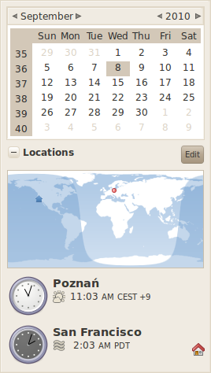
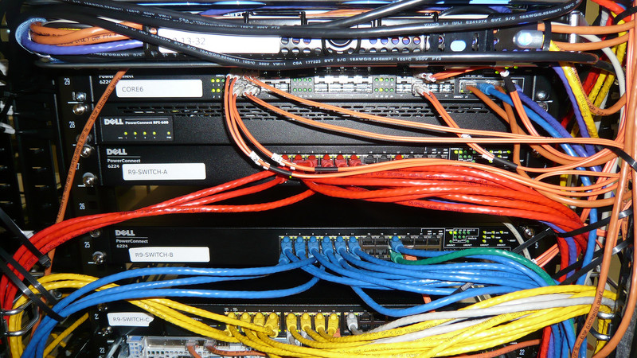
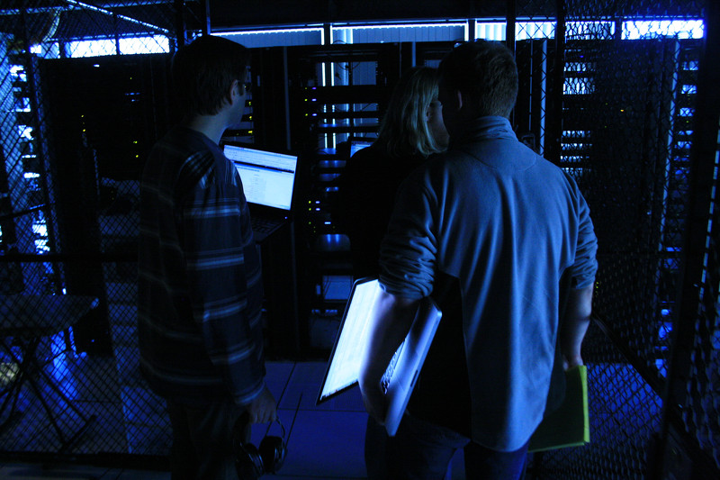
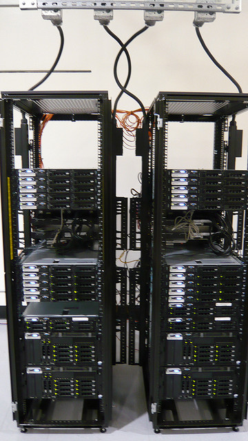

!SLIDE

# **Ops**

!SLIDE bullets

# Small Team

* 2 Mgmt/Ops
* 3 Dedicated Ops

!SLIDE

# Multiple Time Zones

# 

### Yay for 24hr coverage

!SLIDE bullets

# Very little "cloud"

* S3 for backups
* Rackspace for ops irc

!SLIDE bullets

# Some virtualization
* KVM (Some lingering Xen)
* Development enivronment
* Some low volume network services

!SLIDE

# Real hardware

# 

!SLIDE

# Two Datacenters

!SLIDE center

# 

!SLIDE center

# 

!SLIDE bullets

# CDN Nodes

* Frankfurt
* London

!SLIDE
 
# Free Software Stack

!SLIDE bullets

# MediaWiki

* Apache
* PHP
* MySQL
* Memcache
* Varnish

!SLIDE bullets

* Ubuntu
* Riak
* Sass
* Solr
* Scribe

!SLIDE bullets

# Free Software Operations

* Chef
* Ganglia
* Nagios
* runit
* Racktables

